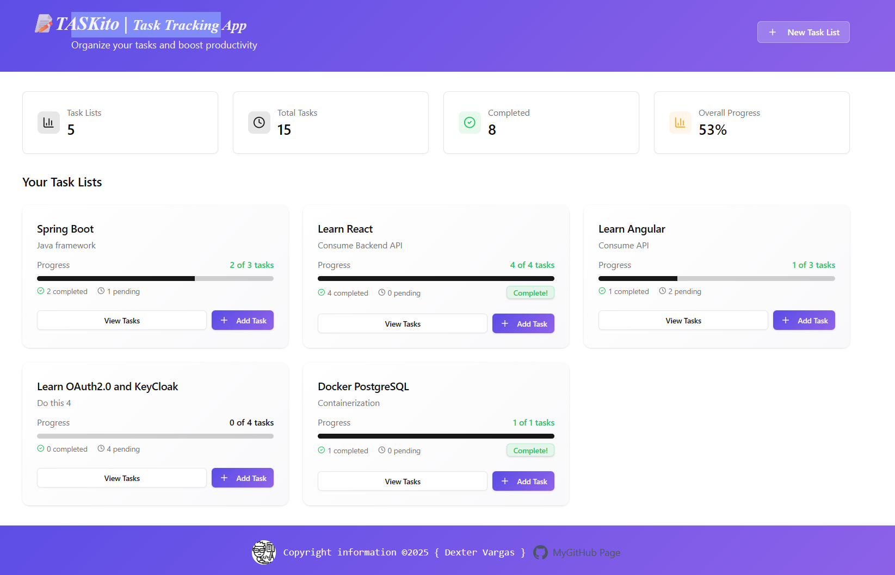

# TASKito | Task Tracking App

A modern and fully functional **Task Tracker App**  
Built with a clean interface, smooth animations, and professional design to make task management simple and effective.

---

### Backend Repo for API | Spring Boot, Docker, PostgreSQL
https://github.com/DexterVargas/Spring-Boot-task-tracker-API 

`frontend`:: const API_BASE_URL = "http://localhost:8585"; 
---
## ✨ Features

### 📊 Dashboard & Progress Tracking
- Overview with total stats and progress bars  
- Real-time completion percentages  
- Modern card-based layout with gradient design  

### 📝 Full CRUD Operations
- Task Lists: create, edit, delete  
- Tasks: create, edit, delete  
- Toggle task status (OPEN/CLOSED)  
- Manage task priority (HIGH / MEDIUM / LOW)  

### 🎨 Beautiful Design System
- Blue–purple gradient theme  
- Priority-based color coding (red/orange/green)  
- Smooth animations & hover effects  
- Responsive card-based layout  

### 🔍 Advanced Task Management
- Detailed task list views with filtering  
- Sort by due date, priority, or creation date  
- Filter by status and priority  
- Overdue task indicators  

### 📱 Professional UI
- Toast notifications for user feedback  
- Intuitive navigation between views  
- Progress bars updating in rea

### UI Screenshots

